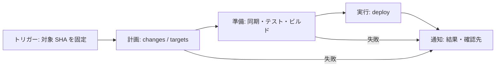

> **For agents:** This document is the authoritative design; align the implementation with it. Design changes require explicit user instruction.

# デプロイ設計

## このドキュメントの目的

このドキュメントは，[デプロイのメンタルモデル](./deploy-model.md)をもとに，自動デプロイの設計を定めます．用語はメンタルモデルに従います．GitHub Actions で受け付けたデプロイ要求について，対象選定，設定・成果物の生成，反映，結果通知までの責務と入出力を扱います．現在の実装がすべてこの設計を満たすことを意味しません．

環境変数，`deployment.yaml`，設定の優先順位は，[環境設定の設計](./configuration-design.md)に従います．

## 基本方針

操作時に指定するのは channel です．purpose と profile は channel から一意に導出します．

| Channel   | Purpose（目的） | Profile（設定の基準） | 環境の識別                  |
| --------- | --------------- | --------------------- | --------------------------- |
| `staging` | `update`        | `staging`             | staging 環境                |
| `release` | `update`        | `release`             | release 環境                |
| `preview` | `review`        | `staging`             | PR 番号ごとのレビュー用環境 |

purpose が `update` の場合は，変更の影響を受けるパッケージを更新します．purpose が `review` の場合は，変更を確認するための利用経路に必要なパッケージを選び，その中の接続を preview 向けに組み替えます．選択単位はワークスペースパッケージであり，実際にデプロイできるかは対象コミットの `package.json` に `scripts.deploy` があるかで判断します．

selection source は起点の求め方を表し，`diff`・`full`・`manual-pick` のいずれかです．mode は purpose と selection source の有効な組み合わせであり，独立した設定項目ではありません．本書では `(purpose, selection source)` と表記します．

| Mode                      | Channel           | 対象選定の概要                                   |
| ------------------------- | ----------------- | ------------------------------------------------ |
| (`update`, `diff`)        | staging / release | 差分の影響を受けるパッケージを更新する           |
| (`update`, `full`)        | staging / release | 全パッケージを候補として更新する                 |
| (`review`, `diff`)        | preview           | 差分の影響を起点に確認経路を選ぶ                 |
| (`review`, `manual-pick`) | preview           | 指定パッケージとその影響先を起点に確認経路を選ぶ |

トリガーは対応する mode の計画処理を起動します．mode を必須の受け渡しフィールドとしては規定しません．計画中に (`update`, `diff`) から (`update`, `full`) へ切り替える場合も，対象 SHA と channel を維持します．

## 全体構成と入出力

GitHub Actions の Workflow が全体を制御し，対象選定には Turborepo と補助スクリプト，設定生成には `@repo/app-config`，テスト・ビルド・デプロイには各パッケージのスクリプトを使用します．フェーズは責務の区分であり，それぞれを独立したジョブやスクリプトにすることは必須ではありません．

| フェーズ | 責務                                               | 出力                                                         |
| -------- | -------------------------------------------------- | ------------------------------------------------------------ |
| トリガー | 起動条件と開始時の mode を決め，対象の版を固定する | channel，対象 SHA，比較基準 SHA，PR 番号，手動指定パッケージ |
| 計画     | テスト対象・デプロイ候補を選び，接続方針を決める   | `changes` と `targets`                                       |
| 準備     | 依存解決，設定同期，テスト，成果物生成を行う       | デプロイアーティファクト                                     |
| 実行     | デプロイ可能な候補を反映する                       | パッケージごとの実行結果と標準出力                           |
| 通知     | 成否と確認先を記録・通知する                       | Actions の実行記録，preview の PR コメント                   |

比較基準 SHA は selection source が `diff` の場合，PR 番号は preview，手動指定パッケージは selection source が `manual-pick` の場合に使用します．要求の対象 SHA は全フェーズで共通とし，途中でタグやブランチの最新位置に読み替えません．



## トリガーフェーズ

### 起動条件と対象コミット

| Channel / Mode                        | 起動条件                                            | 比較基準（BASE）             | 対象（HEAD）                         |
| ------------------------------------- | --------------------------------------------------- | ---------------------------- | ------------------------------------ |
| staging / (`update`, `diff`)          | `staging` タグの付け替え                            | 付け替え前のコミット         | 付け替え先のコミット                 |
| release / (`update`, `diff`)          | `release` タグの付け替え                            | 付け替え前のコミット         | 付け替え先のコミット                 |
| staging・release / (`update`, `full`) | channel を指定した `workflow_dispatch`              | 使用しない                   | 受付時に対応するタグが指すコミット   |
| preview / (`review`, `diff`)          | main 向け PR の `opened`・`reopened`・`synchronize` | 起動時の PR の base コミット | 起動時の PR の head コミット         |
| preview / (`review`, `manual-pick`)   | PR コメントの `/preview <package-name> ...`         | 使用しない                   | コマンド受付時の PR の head コミット |

手動の full で任意のコミットを直接指定することはできません．指定した channel のタグを解決し，その SHA を固定します．manual-pick でも，パッケージの実在性確認からデプロイまで同じ head SHA を使用します．

`release` タグの付け替えは，本番反映の決定を表します．タグを動かす前の認証・承認，候補の確認フローは本書の対象外です．タグを更新する Workflow は，後続のデプロイ Workflow を起動するため，GitHub App のインストールアクセストークンでタグを push する設計とします．

### 同時に発生した要求の扱い

purpose が `update` の場合は，同じ channel の要求を排他にし，実行中の要求をキャンセルせず，concurrency の待機に入った順に処理します．手動の full も同じ制御に含めます．

purpose が `review` の場合は，同じ PR の実行中の要求をキャンセルせず，待機中は一件だけ保持し，後続要求で置き換えます．selection source が `diff`・`manual-pick` のどちらでも，削除要求と共通の PR 単位の制御に含めます．

## 計画フェーズ

### 共通処理と出力形式

対象 SHA を checkout し，そのコミットのパッケージと設定を使って計画します．selection source が `diff` の場合は比較に必要な履歴を取得し，`full`・`manual-pick` では対象コミットのみを取得します．

出力は，次の形式の JSON として `GITHUB_OUTPUT` に書き込みます．`changes` はパッケージ名の配列，`targets` はパッケージ名・パス・任意のWorker基底名を持つ配列です．

```json
{
  "changes": ["@repo/example-api"],
  "targets": [
    { "package": "@repo/example-api", "path": "apps/example-api", "workerName": "example-api" },
    { "package": "@repo/example-web", "path": "apps/example-web", "workerName": "example-web" }
  ]
}
```

`workerName` は対象コミットの `wrangler.jsonc` の `name` を計画時に収集した値で、channelのサフィックスを含みません。Worker設定のない候補では省略します。後続にはこの配列を `TARGETS` として渡し、Worker名の再収集や別環境変数による受け渡しは行いません。

`changes` はテスト対象，`targets` はデプロイ候補です．どちらにも `scripts.test`や`scripts.deploy` のないパッケージが含まれ得ます．計画時にはこれを除外せず，実行時にテスト・デプロイをスキップします．

channel や PR 番号などは計画結果へ再出力せず，後続フェーズがトリガーの出力を直接参照します．接続方針は channel と `targets` から決まるため，具体的な URL や Service Binding の値は準備フェーズで生成できます．

### mode (`update`, `diff`)

通常経路では，固定した BASE と HEAD に対して次の選定を行います．

| 出力      | 選定方法                                                   |
| --------- | ---------------------------------------------------------- |
| `changes` | BASE と HEAD の比較で直接変更されたパッケージ              |
| `targets` | 直接変更されたパッケージと，パッケージ依存関係による影響先 |

デプロイ時に統合テストは行わず，直接変更されたパッケージをテスト対象とします．接続構成は channel に対応する profile の設定を採用し，計画時の個別の組み替えは行いません．

次の場合は，同じ対象 SHA の mode (`update`, `full`) へフォールバックします．

- タグの初回作成などで比較基準が存在しない．
- 比較処理に失敗した．
- 巻き戻しや分岐をまたぐタグ移動により，指定した差分比較では移動前後の変更を正しく捉えられない．

比較が成功して結果が空だった場合は，検出失敗として扱いません．

### mode (`update`, `full`)

変更検知を行わず，対象コミットの全ワークスペースパッケージを `changes` と `targets` の両方に設定します．全候補をテスト対象とし，接続構成は (`update`, `diff`) と共通です．

### mode (`review`, `diff`)

`changes` は (`update`, `diff`) と同じ直接変更の検出結果です．`targets` は，直接変更されたパッケージとパッケージ依存関係による影響先を起点として，次の connection グラフから求めます．BASE は起動時の PR の base であり，前回 preview をデプロイしたコミットではありません．

### review に共通の connection グラフ

ここでいう connection グラフは，パッケージ間の接続関係とレビュー対象の選定規則を表す理論モデルです．実装上のデータ構造，ノードの保持フィールド，シリアライズ形式や探索アルゴリズムを規定するものではありません．

対象の版に存在するワークスペースパッケージの集合を頂点集合 `V` とします．パッケージ `u` の `deployment.yaml` の `connections.bindings` または `connections.urls` にパッケージ `v` への接続が宣言されている場合，有向辺 `u → v` があると考えます．したがって，Web が API を利用する関係は `Web → API` と表します．自己ループと実在しないパッケージへの接続はこの関係に含めず，同じ接続が複数宣言されていても一つの関係として扱います．設定の省略や不正な `reviewEntry` の扱いは，環境設定の設計に従います．

直接変更または手動指定からパッケージ依存関係の影響を展開した起点集合を `S`，`reviewEntry: true` の確認入口集合を `E` とします．`u →* v` は，接続関係に沿って `u` から `v` へ到達可能であることを表します．長さ 0 の経路を認めるため，各頂点は自身へ到達可能です．

デプロイ候補の集合は，次の条件で定義します．

```text
targets = { v ∈ V | ある e ∈ E と s ∈ S について e →* v かつ v →* s }
```

つまり，確認入口から利用でき，かつ起点を直接または間接に利用するパッケージを候補とします．この定義は循環を含む接続関係にも適用され，経路上の頂点が重複しないことは要求しません．起点自身が確認入口ならそのパッケージも含まれ，どの確認入口からも到達できない起点は候補に含まれません．起点集合または確認入口集合が空なら，候補も空です．

たとえば Web が API に接続し，Web に `reviewEntry: true` がある場合，API の変更に対して API と Web を候補に含めます．Web が別の未変更 API にも接続していて，その API が起点へ到達できない場合，そちらは候補に含めず，接続は staging のままとします．

### mode (`review`, `manual-pick`)

`/preview <package-name> ...` の引数を手動指定の起点とします．パッケージ名は通常 `@repo/xxxx` の形式です．変更検知は行わず，固定した対象 SHA で指定パッケージの実在性を確認します．

| 入力                       | 結果                                                                                                |
| -------------------------- | --------------------------------------------------------------------------------------------------- |
| 引数が空                   | 異常終了し，Usage として `/preview <package-name> ...` を案内する                                   |
| 実在しないパッケージを含む | 異常終了し，PR の返信コメントで通知する．実在した指定があれば，それだけを用いた修正コマンド例を示す |
| 全指定が実在する           | 指定パッケージを `changes` に設定し，対象選定を続ける                                               |

実在性確認による入力エラーは，待機を終えて runner 上で処理を実行開始してから理想的には 10 秒以内，遅くとも 20 秒以内に返すことを要件とします．

`targets` は，指定した起点を含め，パッケージ依存関係による影響先へ展開したうえで，通常経路と同じ connection グラフの探索で対象を収集します．接続の差し替え規則は通常経路と共通です．

### preview の接続方針

staging profile の設定を基礎に，`connections` で指定された接続先が `targets` 内の Worker であれば preview 向けに差し替えます．`targets` 外の既存リソースへの接続は staging の設定を維持します．

| 項目            | preview の値                                                                                |
| --------------- | ------------------------------------------------------------------------------------------- |
| Worker 名       | `{素のWorker名}-preview-pr-{PR_NUMBER}`                                                     |
| Worker の URL   | `https://{素のWorker名}-preview-pr-{PR_NUMBER}.nushinkan2.workers.dev` を基にしたベース URL |
| Service Binding | 接続先の preview Worker 名                                                                  |

素の Worker 名は profile のサフィックスを付ける前の名前です．staging のサフィックスに preview のサフィックスを重ねることはしません．URL は環境設定の設計に従い，必要なパスを含むベース URL として扱います．

## 準備フェーズ

### 実行順序

1. テスト・ビルド・app-config に必要な `devDependencies` を含めて依存解決する．
2. `@repo/app-config` を実行可能な状態に整え，local の環境変数をネイティブファイルに同期する．
3. `changes` のパッケージを対象に，テストを実行する．
4. `targets` のパッケージを対象に，デプロイアーティファクトを生成する．

テストとビルドは Turborepo を介して各パッケージの `test`・`build` スクリプトに依頼します．全対象の準備が成功してから実行フェーズへ進みます．テストまたは成果物生成に失敗した場合は Workflow 全体を異常終了し，preview では PR コメントで通知します．

### ビルドへの入力

Workflow は環境変数を介して次の入力を `build` スクリプトへ渡します．

| 入力             | 内容・検証                                                           |
| ---------------- | -------------------------------------------------------------------- |
| `DEPLOY_CHANNEL` | `staging`・`release`・`preview` のいずれか                           |
| `PR_NUMBER`      | preview は正の整数．それ以外では `-1` を渡し，生成処理では使用しない |
| `targets`        | 計画したデプロイ候補の集合．接続先の差し替え判定に使う               |

`targets` は論理的な入力名です．環境変数名とシリアライズ形式の具体化は，実装計画で扱います．

ローカルで `build` を呼び出し，デプロイ用入力が提供されない場合は local 用のビルドとします．デプロイ用アーティファクトの生成処理では，`DEPLOY_CHANNEL` の未指定・未知の値，preview の不正な PR 番号，接続生成に必要な入力・設定の不足をエラーにします．

### デプロイアーティファクト

各パッケージのデプロイ用 `build` は，`@repo/app-config` の `app-build` を利用して，パッケージ直下に `.env.deploy` と `wrangler.deploy.jsonc` を生成します．frontend では，配信するビルド成果物 `dist` も用意します．

purpose が `update` の場合は，環境設定の設計に従い，対応する profile の値を反映します．preview では staging profile を基礎に生成し，計画した接続方針で上書きします．設定値の優先順位は，高い順に次のとおりです．

1. preview 用の上書き．
2. `deployment.yaml` の `envs`．
3. `globalRuntimeEnvs.yaml` の対応する profile の設定．
4. 各パッケージのネイティブファイルの設定．

preview の `wrangler.deploy.jsonc` は `name` を preview Worker 名にし，`routes` を削除してカスタムドメインを無効化します．この構成の Worker 間通信には Service Binding を使用する方針とし，Worker から別の Worker への直接の URL fetch に依存しない構成にします．

### 対象が空の場合

`targets` が空でも `changes` があればテストします．デプロイ用アーティファクトの生成とデプロイは行いません．空の集合を「全パッケージ指定」として実行しないようにします．

テストが成功した場合，selection source が `diff`・`full` なら正常終了します．`manual-pick` なら，デプロイ可能な対象がなかったものとして異常終了し，PR コメントで通知します．

## 実行フェーズ

`targets` のうち，対象コミットの `package.json` に `scripts.deploy` が定義されたパッケージをデプロイします．定義のないパッケージはスキップします．この規則は四つの mode に共通です．

Turborepo を介して各パッケージの `deploy` スクリプトを実行し，通知用に標準出力を保持します．mode (`update`, `full`) では，全ワークスペースパッケージの実行可能な deploy タスクを再実行し，過去の実行結果による省略を許しません．

各対象は並列数の上限内で実行し，一部が失敗しても残りのデプロイを続行します．一つでもデプロイが失敗した場合は Workflow 全体を異常終了しますが，preview の通知フェーズは実行します．複数パッケージの反映は原子的な切り替えではなく，一部のみ反映された状態があり得ます．

`targets` が空でなくても，実行可能な deploy タスクが一つもない場合，selection source が `diff`・`full` なら正常終了します．`manual-pick` なら異常終了し，デプロイ可能な対象がなかったことを PR に通知します．

## 通知フェーズ

purpose が `update` の場合は，専用の外部通知は行いません．対象 SHA，比較基準，選定結果，各フェーズの成否を Actions のログで確認できるようにします．

purpose が `review` の場合は，実行フェーズの標準出力を解析し，対象 PR に結果をコメントします．対象の版とともに，対象となった各パッケージについて次を示します．

| 項目             | 内容                                     |
| ---------------- | ---------------------------------------- |
| パッケージ名     | 対象パッケージの識別子                   |
| 結果             | デプロイ済み・デプロイ不要・デプロイ失敗 |
| Worker 名        | 存在する場合に表示                       |
| 確認用 URL       | frontend で存在する場合に表示            |
| エラーメッセージ | デプロイ失敗の場合に表示                 |

入力検証・計画・準備で失敗し，デプロイを実行していない場合も，失敗したフェーズと理由をコメントします．通知の失敗とデプロイの失敗は区別し，通知だけが失敗した場合にデプロイをやり直す必要はありません．

## 失敗後の運用とクリーンアップ

mode (`update`, `diff`) は，前回のタグ位置と比較します．前回デプロイに成功したコミットとの比較ではありません．失敗後にそのままタグを更新すると，未反映の変更が次の差分に含まれない可能性があります．

そのため，失敗後は対象 channel のタグが指すコミットを手動の full で再デプロイし，復旧を確認してから通常のタグ更新を再開します．preview で失敗や対象の拾い漏れがある場合は，`/preview <package-name> ...` による manual-pick を使用します．

レビュー用環境のクリーンアップは，メンタルモデルに従い，その環境のために作成・管理したリソース全体を対象とします．最後の計画だけでなく，過去のデプロイや途中終了で残ったリソースも対象に含め，共有・既存の staging リソースは削除対象に含めません．起動条件，リソースの追跡方法，削除方式は別途定めます．


## 実装の責務境界

workspaceの取得・検証・Worker情報収集は `scripts/workspace/`、計画とタスク実行・結果集計は `scripts/deploy/` が担当する。`.github/` は入力の取得とGitHub固有の制御・通知を担当し、CLIとJSONでリポジトリ処理へ接続する。
