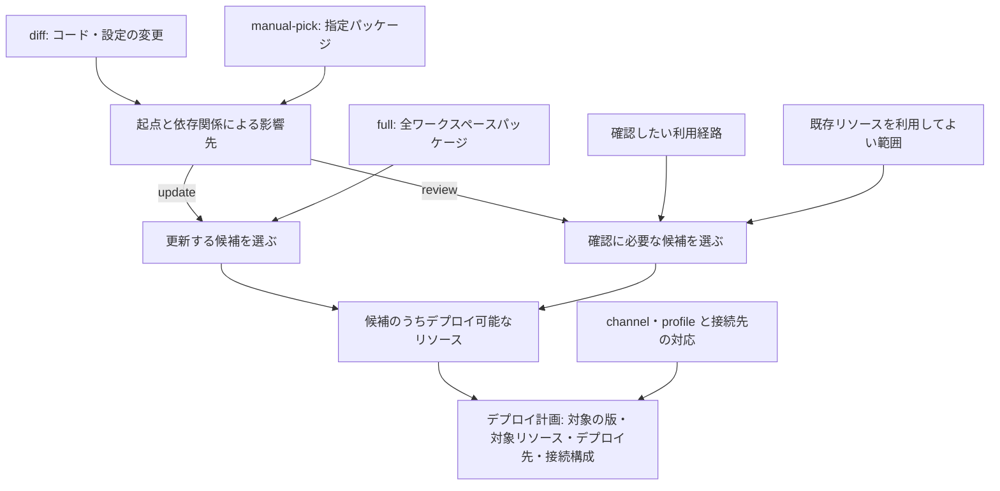

> **For agents:** This document is the authoritative design; align the implementation with it. Design changes require explicit user instruction.

# デプロイ

## デプロイを捉える二つの観点

デプロイは，デプロイ先・目的・対象選定方式・設定の基準を定める **デプロイ方針（Deployment Policy）** と，トリガーからデプロイ完了までの仕事を分ける **デプロイフェーズ（Deployment Phases）** の二つの観点で整理します．

以下のデプロイ方針とデプロイフェーズは，実現方式から独立した設計上のモデルです．このモデルがすべて実現済みであることを意味しません．

## デプロイ方針（Deployment Policy）

### Channel・Purpose・Profile

操作時に指定するのは **channel** です．各 channel は，デプロイの目的を表す **purpose** と，設定の基準を表す **profile** を持ちます．purpose と profile は channel から一意に導出し，独立した入力として自由に組み合わせません．

| Channel（デプロイ先の区分） | Purpose（デプロイの目的） | Profile（設定の基準） |
| --------------------------- | ------------------------- | --------------------- |
| `release`                   | `update`                  | `release`             |
| `staging`                   | `update`                  | `staging`             |
| `preview`                   | `review`                  | `staging`             |

profile には，このほかに `pnpm dev` などで起動するローカル開発用の `local` があります．上の表はデプロイ channel とその purpose・profile の対応を示しているため，ローカル開発用の profile は含めていません．

`preview` channel は，変更をレビューするために，`staging` profile を基礎として必要なリソースと接続構成を用意します．profile は設定の出発点であり，preview のリソース名や接続先まで staging と同じにするという意味ではありません．

命名上，`preview` は確認用のデプロイ先を，`review` は人が変更を確認するという目的を表します．似た語彙ですが，デプロイ先と目的という役割で区別します．purpose が `update` の場合でも品質確認のテストは行い，purpose が `review` の場合でも自動テストを利用できます．purpose はテストの実施方式を指定するものではありません．

日常の操作説明では channel を使い，対象選定の説明では目的を表す purpose と起点の求め方を表す selection source，その組み合わせを表す mode，設定生成の説明では profile を使います．

### デプロイの目的（purpose）と対象選定

| Purpose  | 利用する channel  | 目的                                                                           | デプロイ対象と接続先                                                       |
| -------- | ----------------- | ------------------------------------------------------------------------------ | -------------------------------------------------------------------------- |
| `update` | staging / release | 変更のあったリソースを反映し，利用者に最新の動作を提供する                     | 変更の影響で更新が必要なリソースをデプロイし，その環境のリソースと接続する |
| `review` | preview           | 人が変更をレビューするために，一連の利用経路を通して動作を確認できるようにする | 確認に必要なリソースをまとめてデプロイし，確認対象へ接続するよう設定する   |

purpose はデプロイの目的を表します．対象選定方式が変わっても目的は変わらないため，たとえば preview の更新時に差分だけをデプロイする場合も，目的は `review` のままです．

ここでいうリソースは，動作・接続・デプロイを考える単位です．このプロジェクトではパッケージ（package.jsonが配置されたディレクトリ）がそれに当たります．共有パッケージの変更も，それを取り込むパッケージの更新理由になり得ます．

たとえば `Web → API` という構成で API だけを変更したとします．purpose が `update` の場合は，Web の再デプロイが不要なら API のみを更新します．purpose が `review` の場合は，ブラウザから確認するために未変更の Web もデプロイし，その Web が preview の API を参照するようにします．確認対象は API でも，デプロイ対象は Web と API になります．

このため preview の対象は，変更されたリソースや，そのリソースが依存する先だけからは決まりません．確認対象を呼び出す側も含め，確認したい利用経路から決めます．グループ外の既存リソースを利用してよい範囲は別途定めます．表中の「まとめてデプロイする」という説明は，論理的なグループを意味し，同時実行や全件の原子的な切り替えを要求するものではありません．

### 選定の起点（selection source）

selection source は，デプロイ対象の選定の起点をどのように求めるかを表します．selection source に従って起点を求め，purpose に応じて対象の広げ方を決めます．

| Selection source | 起点の求め方                                           |
| ---------------- | ------------------------------------------------------ |
| `diff`           | 対象の版と比較基準との差分から変更を検出する           |
| `full`           | 対象の版に存在する全ワークスペースパッケージを列挙する |
| `manual-pick`    | デプロイを要求する人が指定したパッケージを起点とする   |

purpose と profile は channel から一意に決まります．selection source は，起動の契機や計画時の状況に応じて選びます．

### デプロイの実行方式（mode）

mode は，purpose と selection source の有効な組み合わせを表します．本モデルで扱う組み合わせは次の四つです．表では，mode を `(purpose, selection source)` と表記します．

| Mode                      | 利用する channel  | 利用場面       | 振る舞い                                                       |
| ------------------------- | ----------------- | -------------- | -------------------------------------------------------------- |
| (`update`, `diff`)        | staging / release | 通常           | 差分の影響から更新が必要なリソースを選ぶ                       |
| (`update`, `full`)        | staging / release | フォールバック | 全パッケージのうちデプロイ可能なものを更新する                 |
| (`review`, `diff`)        | preview           | 通常           | 差分の影響を起点に，確認に必要な利用経路を選ぶ                 |
| (`review`, `manual-pick`) | preview           | フォールバック | 指定パッケージとその影響先を起点に，確認に必要な利用経路を選ぶ |

mode は purpose と selection source をまとめて呼ぶ概念であり，それらとは独立した設定項目ではありません．すべての purpose と selection source を自由に組み合わせることはできません．

mode は，その時点で採用する実行方式です．トリガーで選択した方式から，計画中に selection source を切り替えることで別の mode に移る場合もあります．

## デプロイフェーズ（Deployment Phases）

### 五つのフェーズ

デプロイは，トリガー・計画・準備・実行・通知の五つのフェーズで捉えます．イベントや操作からデプロイ要求を受け付け，channel の方針に基づいて計画し，デプロイ可能な状態を準備して変更を反映し，結果を伝えます．

| フェーズ    | 決めること・行うこと                                                                                                | 出力                                                                                      |
| ----------- | ------------------------------------------------------------------------------------------------------------------- | ----------------------------------------------------------------------------------------- |
| 1. トリガー | イベントや操作が起動条件を満たすか判断し，channel と開始時の mode を決め，対応する計画処理を起動する                | channel，対象の版や比較基準を特定する情報，レビュー用環境の識別情報などの起動コンテキスト |
| 2. 計画     | selection source に応じて選定の起点と影響を調べ，purpose に基づいて対象の版・リソース・デプロイ先・接続構成を決める | 対象の版，対象リソース，デプロイ先，接続構成を含む計画                                    |
| 3. 準備     | 計画に基づき，コードや設定などをデプロイ可能な状態にする                                                            | デプロイ可能な成果物・設定                                                                |
| 4. 実行     | 必要な順序でリソースを作成・更新し，デプロイ先へ変更を反映する                                                      | リソースごとの実行結果，反映された版・構成，アクセス先                                    |
| 5. 通知     | デプロイ結果を確認・記録し，channel に応じた相手・場所へ伝える                                                      | 成功・一部失敗・失敗などの記録と通知，確認用 URL                                          |

次の図は，各フェーズが受け取り，次へ渡す情報を示します．

図は代表的な情報の流れを示します．途中で失敗した場合も，その結果は通知の対象になります．

これは責務の流れであり，各フェーズを別スクリプトや別ジョブにする必要はありません．複数リソースでは，あるリソースの実行結果を使って別のリソースを準備するなど，準備と実行を繰り返す場合もあります．

### 1. トリガーフェーズ

トリガーは，いつ・何をきっかけに・どの channel のデプロイを開始するかを扱います．イベントや操作が channel ごとの起動条件を満たすか判断し，channel から決まる purpose と，起動の契機に応じた selection source によって開始時の mode を定め，対応する計画処理を起動します．

| Channel   | 起動の契機                                                                     | 対象の版                   |
| --------- | ------------------------------------------------------------------------------ | -------------------------- |
| `preview` | 変更をレビューできる状態にしたいとき，またはレビュー対象の変更が更新されたとき | レビューしたい変更の版     |
| `staging` | 次にリリースする候補を選定・更新したとき                                       | リリース候補として選んだ版 |
| `release` | 特定の候補の確認が完了し，本番への反映を決定したとき                           | 確認済みのリリース候補の版 |

staging 環境は，次にリリースする候補を確認する場所です．候補として選んだ版をデプロイし，その版について確認を進めます．

staging 環境で確認している間は，対象の候補を固定します．候補を差し替える場合は新たにデプロイフローを起動する契機として扱い，確認結果も候補の版に対応づけて見直します．release へ送るのは，本番反映を決定した確認済みの版です．その後に開発や staging の更新が進んでも，その要求が指す版が直ちに変わることはありません．

デプロイ要求には channel と，対象の版を特定するための情報を含めます．selection source が `diff` の場合は比較基準を特定する情報，`manual-pick` の場合は指定パッケージの情報も必要です．preview では，どのレビュー用環境を作成・更新するかを識別する情報も含めます．次の計画フェーズでは，selection source に応じてこれらの情報から選定の起点を求め，リソースの一覧や接続構成を決めます．

起動条件をどのイベントや操作で表現するかは，実装・運用で定めます．詳細は[設計ドキュメント](deploy-design.md)を参照してください．

### 2. 計画フェーズ

計画は，どの版の，どのリソースを，どこへ，どの接続構成でデプロイするかを決めるフェーズです．トリガーから受け取った要求を，次の手順で具体化します．

1. **要求を具体化する**：トリガーから受け取った情報をもとに，対象の版と，selection source に必要な比較基準や指定パッケージを確定する．purpose と profile は channel から導出する．
2. **選定の起点を求める**：selection source に従い，`diff` ではコードや設定の変更を検出し，`full` では全ワークスペースパッケージを列挙し，`manual-pick` では指定パッケージを確認する．
3. **影響をリソースへ対応づける**：`diff`・`manual-pick` では，起点となる共有パッケージなどの影響を，動作や成果物に関係するリソースへ対応づける．`full` では全パッケージを候補とする．
4. **目的に応じて対象を選ぶ**：purpose が `update` の場合は更新する集合を，`review` の場合は確認したい利用経路に必要な集合を決める．実際のデプロイ対象は，候補のうちデプロイ可能なリソースとする．
5. **接続構成を決める**：profile を設定の基準として，各リソースの接続関係を決める．purpose が `review` の場合は，確認用グループ内のリソースとグループ外の既存リソースを区別する．

次の図は，selection source ごとの起点から，purpose に応じてデプロイ対象集合を求める過程を示します．

`diff`・`full`・`manual-pick` は selection source の選択肢であり，`update` と `review` は purpose に応じた分岐です．上記の mode の表で定めた有効な組み合わせに沿って処理し，それぞれの結果をすべて合わせる意味ではありません．たとえば API の変更を Web 経由で確認する場合，`review` のデプロイ対象集合には，未変更の Web も含まれます．既存リソースを利用する場合は，そのリソースを今回のデプロイ対象から外しても，接続先として計画に含めます．

計画の出力は，対象の版・対象リソース・デプロイ先・接続構成です．接続構成では，どのリソースがどのリソースを参照するかを決めます．URL など，リソース作成後に決まる具体値は後続で解決できるようにし，この段階ですべての値が揃うことを前提にしません．

変更の影響があるリソースの集合と，レビューに必要なリソースの集合は区別します．後者は，確認したい利用経路から選びます．

なお，変更検出の比較基準の選定方法や，purpose が `review` の場合の利用経路の表現方法，既存リソースの利用方針などについては，[設計ドキュメント](deploy-design.md)を参照してください．

### 3. 準備フェーズ

準備は，計画に基づいて **デプロイアーティファクト** を生成するフェーズです．デプロイアーティファクトとは，実行フェーズで使用するコードや静的ファイル，設定などの成果物を指します．

1. **設定値の反映**：profile を基礎に，channel に応じたリソース名や，計画した接続関係を具体的な設定に落とし込みます．設定値は，ビルド時に使うものと，デプロイ先での動作に使うものに反映します．
2. **ビルド**：計画で指定した版のコードと必要な設定値から，実行可能なコードや配信する静的ファイルなどを生成します．必要な処理はリソースの種類によって異なります．

このフェーズの出力は，計画したリソースをデプロイできる状態に整えたアーティファクトです．実行フェーズは，これを使ってデプロイ先へ変更を反映します．

### 4. 実行フェーズ

準備した成果物や設定を用いて，デプロイ先のリソースを作成・更新します．リソース間に実行順序の制約がある場合はそれに従い，各リソースへ実際に反映できた版・構成とアクセス先を把握します．

複数リソースの一部だけが成功する場合もあります．計画全体を反映できたかと，個々のリソースの実行結果を区別して，通知フェーズへ渡します．

デプロイの成功とは，計画したリソースがアップロードされ，接続構成が反映されて，利用・確認ができる状態になることをいいます．

### 5. 通知フェーズ

通知は，デプロイ結果を確認・記録し，その結果を必要とする人へ伝えるフェーズです．成功時だけでなく，途中で失敗した場合も，どこまで進んだかを伝えます．

purpose が `review` の場合は，変更をレビューする人へ，確認可能になったこと，確認先，対象の版を伝えます．purpose が `update` の場合は，環境の更新を確認する人へ，更新結果と反映された版を伝えます．具体的な通知手段・通知先は，channel ごとの運用で定めます．

デプロイと通知の成否は区別します．通知だけが失敗した場合，デプロイをやり直す必要はありません．

# フォールバック

本来デプロイしたかったリソースがデプロイされなかった場合や，差分から対象を正しく選べない場合は，channel，purpose，profile を維持し，selection source を変更検知によらないものに切り替えます．この切り替えによって mode も変わります．フォールバックは mode の利用場面を表し，独立した fallback-mode は設けません．

purpose が `update` の場合は，selection source を `full` とした mode (`update`, `full`) を使用し，対象の版にあるデプロイ可能な全パッケージを再デプロイします．また，mode (`update`, `diff`) の計画中に比較基準がないなどの理由で差分を正しく検出できない場合も，対象の版を維持して (`update`, `full`) に切り替えます．

purpose が `review` の場合は，selection source を `manual-pick` とした mode (`review`, `manual-pick`) を使用します．デプロイを要求する人が起点となるパッケージを指定し，その影響先と確認に必要な利用経路から対象を選び直します．

フォールバックの具体的な起動方法や切り替え条件は，[設計ドキュメント](deploy-design.md)で定めます．

# クリーンアップ

クリーンアップは，役目を終えたレビュー用環境のリソースを削除する処理です．対象は，その環境のために作成・管理したリソース全体であり，接続先として利用する共有・既存リソースは含めません．

対象を把握する際は，最後のデプロイ計画だけでなく，過去のデプロイで残っているリソースも考慮します．実装時には，デプロイの途中終了によって残ったリソースにも注意が必要です．
